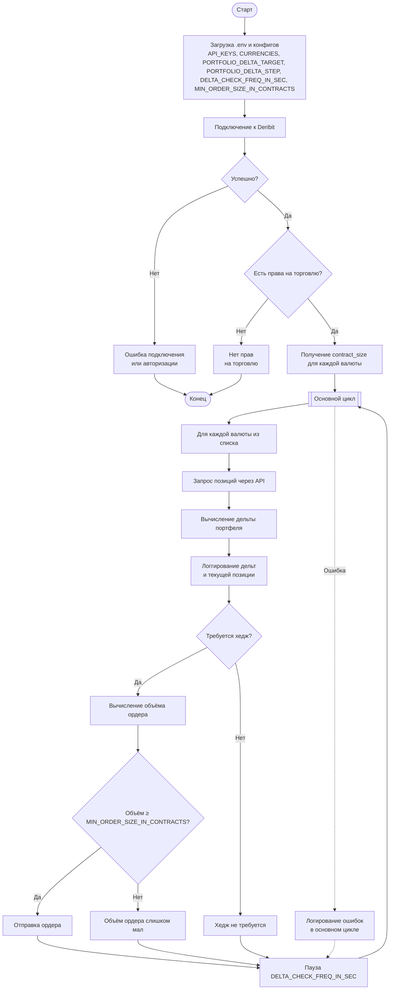

```mermaid
flowchart TD
    Start([Старт])
    LoadEnv[Загрузка .env и конфигов<br>API_KEYS, CURRENCIES, PORTFOLIO_DELTA_TARGET, PORTFOLIO_DELTA_STEP, DELTA_CHECK_FREQ_IN_SEC, MIN_ORDER_SIZE_IN_CONTRACTS ]
    Connect[Подключение к Deribit]
    CheckConnect{Успешно?}
    ErrorConnect[Ошибка подключения<br>или авторизации]
    CheckPerms{Есть права на торговлю?}
    ErrorPerms[Нет прав<br>на торговлю]
    InitContracts[Получение contract_size для каждой валюты]
    MainLoop[[Основной цикл]]
    ForCurrency[Для каждой валюты из списка]
    GetPos[Запрос позиций через API]
    ParsePos[Вычисление дельты портфеля]
    LogPos[Логгирование дельт<br>и текущей позиции]
    CheckHedge{Требуется хедж?}
    CalcOrder[Вычисление объёма ордера]
    MinOrder{Объём ≥ MIN_ORDER_SIZE_IN_CONTRACTS?}
    PlaceOrder[Отправка ордера]
    WarnSmallOrder[Объём ордера слишком мал]
    NoHedge[Хедж не требуется]
    HandleError[Логирование ошибок<br>в основном цикле]
    Sleep[Пауза DELTA_CHECK_FREQ_IN_SEC]
    End([Конец])

    Start --> LoadEnv
    LoadEnv --> Connect
    Connect --> CheckConnect
    CheckConnect -- Нет --> ErrorConnect --> End
    CheckConnect -- Да --> CheckPerms
    CheckPerms -- Нет --> ErrorPerms --> End
    CheckPerms -- Да --> InitContracts
    InitContracts --> MainLoop

    MainLoop --> ForCurrency
    ForCurrency --> GetPos
    GetPos --> ParsePos
    ParsePos --> LogPos
    LogPos --> CheckHedge
    CheckHedge -- Да --> CalcOrder
    CalcOrder --> MinOrder
    MinOrder -- Да --> PlaceOrder --> Sleep
    MinOrder -- Нет --> WarnSmallOrder --> Sleep
    CheckHedge -- Нет --> NoHedge --> Sleep
    Sleep --> MainLoop

    MainLoop -. Ошибка .-> HandleError -.-> Sleep

```
