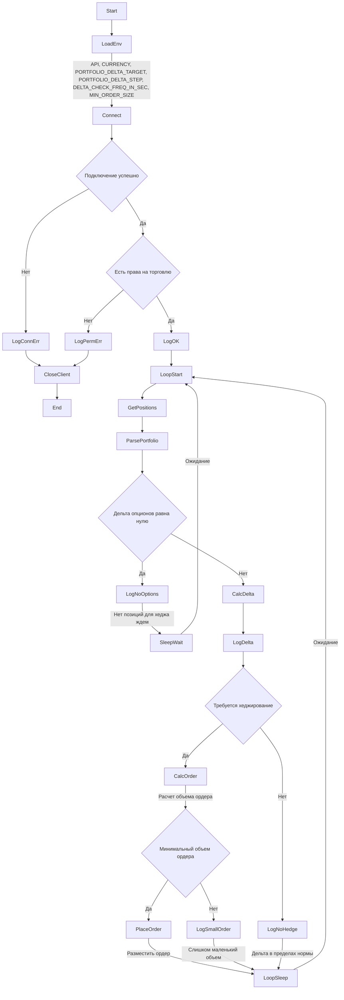

```mermaid
flowchart TD
    Start  --> LoadEnv
    LoadEnv -- API, CURRENCY, PORTFOLIO_DELTA_TARGET, PORTFOLIO_DELTA_STEP, DELTA_CHECK_FREQ_IN_SEC, MIN_ORDER_SIZE --> Connect
    Connect --> ConnError
    ConnError{Подключение успешно}
    ConnError -- Нет --> LogConnErr
    LogConnErr --> CloseClient
    CloseClient --> End
    ConnError -- Да --> CheckPerms
    CheckPerms{Есть права на торговлю}
    CheckPerms -- Нет --> LogPermErr
    LogPermErr  --> CloseClient
    CheckPerms -- Да --> LogOK
    LogOK --> LoopStart
    LoopStart -->  GetPositions
    GetPositions --> ParsePortfolio
    ParsePortfolio --> NoOptions
    NoOptions{Дельта опционов равна нулю}
    NoOptions -- Да --> LogNoOptions
    LogNoOptions -- Нет позиций для хеджа ждем --> SleepWait
    SleepWait -- Ожидание --> LoopStart
    NoOptions -- Нет --> CalcDelta
    CalcDelta --> LogDelta
    LogDelta --> CheckHedge
    CheckHedge{Требуется хеджирование}
    CheckHedge -- Да --> CalcOrder
    CalcOrder -- Расчет объема ордера --> MinOrder
    MinOrder{Минимальный объем ордера}
    MinOrder -- Да --> PlaceOrder
    PlaceOrder -- Разместить ордер --> LoopSleep
    MinOrder -- Нет --> LogSmallOrder
    LogSmallOrder -- Слишком маленький объем --> LoopSleep
    CheckHedge -- Нет --> LogNoHedge
    LogNoHedge -- Дельта в пределах нормы --> LoopSleep
    LoopSleep -- Ожидание --> LoopStart
    End

```
